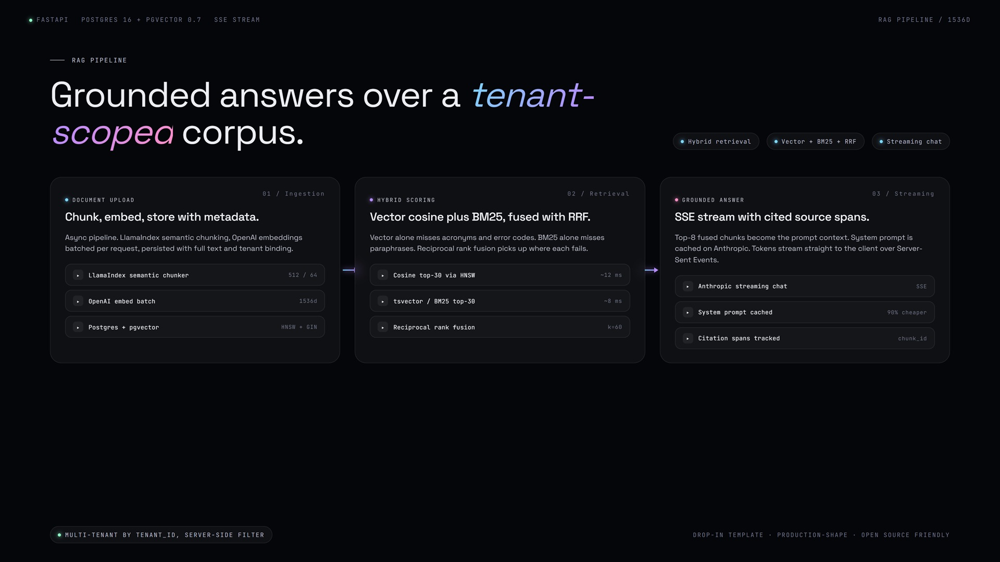

# RAG Pipeline: FastAPI + pgvector + Hybrid Search



A multi-tenant RAG template behind FastAPI. Documents are chunked with LlamaIndex, embedded via OpenAI, stored in pgvector with an HNSW index. Retrieval is hybrid (vector cosine plus Postgres tsvector BM25 fused with Reciprocal Rank Fusion). Chat responses stream from Anthropic Claude with retrieved chunks as context and citation tracking back to source spans. Drop-in shape for any team that needs grounded answers over a tenant-scoped corpus.

## Why hybrid retrieval

Vector search alone misses exact keyword matches like acronyms, error codes, and identifiers. BM25 alone misses paraphrases. Hybrid scores both retrievers independently and fuses the rankings, which fixes both failure modes without needing a learned reranker on top.

## Multi-tenancy

Every chunk row has a `tenant_id`. All retrieval queries filter by it server-side via the `hybrid_search` SQL function. The `tenant_id` comes from a request header in this demo; in production it would tie to a JWT claim.

## Stack

- Python 3.11
- FastAPI 0.110+
- LlamaIndex (chunking only, not the orchestration layer)
- pgvector 0.7+ on PostgreSQL 16
- OpenAI text-embedding-3-small for embeddings
- Anthropic Claude (claude-sonnet-4-6) for chat
- Docker Compose for local Postgres

## Architecture

```
                    ┌─────────────────────────────┐
                    │   Document upload           │
                    │   POST /documents           │
                    └──────────────┬──────────────┘
                                   │ async
                                   ▼
                ┌──────────────────────────────────┐
                │ LlamaIndex semantic chunker      │
                │ chunk_size=512, overlap=64       │
                └──────────────┬───────────────────┘
                                ▼
                ┌──────────────────────────────────┐
                │ OpenAI embed (batched)            │
                │ text-embedding-3-small / 1536d    │
                └──────────────┬───────────────────┘
                                ▼
                ┌──────────────────────────────────┐
                │ Postgres + pgvector              │
                │ chunks(id, tenant, doc, idx,     │
                │   text, embedding vector(1536),  │
                │   tsv tsvector)                  │
                │ HNSW index on embedding          │
                │ GIN index on tsv                 │
                └──────────────────────────────────┘

                    ┌─────────────────────────────┐
                    │   Chat                      │
                    │   POST /chat (SSE stream)   │
                    └──────────────┬──────────────┘
                                   │
            ┌──────────────────────┼──────────────────────┐
            ▼                      ▼                      ▼
    ┌──────────────┐      ┌──────────────┐      ┌──────────────┐
    │ Embed query  │      │ tsvector     │      │              │
    │ via OpenAI   │      │ tsquery from │      │              │
    │              │      │ keywords     │      │              │
    └──────┬───────┘      └──────┬───────┘      │              │
           │                     │               │              │
           │  cosine top 30      │ BM25 top 30   │              │
           ▼                     ▼               │              │
    ┌──────────────────────────────────┐         │              │
    │ Reciprocal rank fusion (RRF)     │         │              │
    │ score = sum(1/(60+rank))         │         │              │
    │ keep top 8                       │         │              │
    └──────────────┬───────────────────┘         │              │
                   ▼                              │              │
    ┌──────────────────────────────────┐         │              │
    │ Build prompt:                    │         │              │
    │ - system (cacheable)             │         │              │
    │ - 8 chunks with citations        │         │              │
    │ - user question                  │         │              │
    └──────────────┬───────────────────┘         │              │
                   ▼                              │              │
    ┌──────────────────────────────────┐         │              │
    │ Anthropic streaming response     │         │              │
    │ Forward SSE to client            │         │              │
    └──────────────────────────────────┘         │              │
```

## Quickstart

```bash
docker compose up -d              # Postgres + pgvector on :5432
psql $DATABASE_URL -f schema.sql

cp .env.example .env
# fill OPENAI_API_KEY, ANTHROPIC_API_KEY

pip install -r requirements.txt
python ingest.py samples/         # ingest the sample corpus
uvicorn main:app --reload         # run on :8000
```

Then:

```bash
# Ingest a doc
curl -X POST localhost:8000/documents \
  -H "x-tenant-id: demo" \
  -F file=@your-doc.txt \
  -F title="Your doc"

# Chat against it (SSE stream)
curl -N -X POST localhost:8000/chat \
  -H "x-tenant-id: demo" \
  -H "content-type: application/json" \
  -d '{"question": "What does the document say about X?"}'
```

## Files

- [main.py](./main.py), FastAPI app with `/documents`, `/chat`, `/health`
- [retrieval.py](./retrieval.py), hybrid retrieval logic (vector + BM25 + RRF fusion)
- [ingest.py](./ingest.py), chunking + embedding + insert
- [chat.py](./chat.py), Anthropic streaming with prompt caching
- [schema.sql](./schema.sql), chunks table + indexes + RLS-style filter helpers
- [docker-compose.yml](./docker-compose.yml), local Postgres + pgvector
- [.env.example](./.env.example), required env vars
- [requirements.txt](./requirements.txt), pinned deps

## Roadmap and known limitations

- No auth on the FastAPI routes. Adding JWT validation in front of `tenant_id` is the next step.
- Single SQL file for the schema. A production system would migrate via Alembic.
- No reranker pass after RRF. A small cross-encoder reranker on the fused top-30 would lift precision at top-8 in exchange for ~50ms.
- Tenant isolation comes from a header. In production this would derive from a validated JWT claim, not user input.
